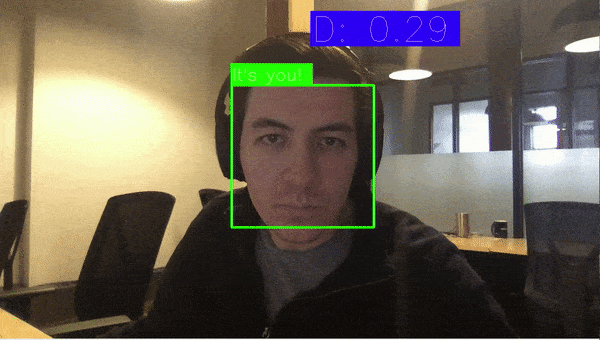

# FaceID using Keras and OpenCV

This project demonstrates how to use Keras to build a face recognition model and apply it live to a cam feed.

## Demo
Yeah that's me.

### Capturing process


### Detection


## Running it

### The NN model
This project uses a model and weights based on [Keras-OpenFace](https://github.com/iwantooxxoox/Keras-OpenFace).

### Capturing
First step is to capture pictures of our own face to be able to recognize it. The capturing script only captures the bounding box around your face and takes a given number of snaps which is indicated on the progressbar.

This is done using the `capture.py` script which takes the following arguments:

```
$ python3 capture.py --help
usage: capture.py [-h] [--output OUTPUT_DIR] [--count COUNT]

optional arguments:
  -h, --help           show this help message and exit
  --output OUTPUT_DIR  Sets the output dir
  --count COUNT        The number of images to capture
```

## Demo/Testing
Once we've generated the pictures of us we can spin up the detection to test it out. The `demo.py` script takes the following parameters:

```
$ python3 demo.py --help
usage: demo.py [-h] [--debug]

optional arguments:
  -h, --help  show this help message and exit
  --debug     Show debug outputs on the screen
```

When running the demo you should see a box around your face and it should be green around your face and blue for other peoples faces, indicating if the face is verified.

## How it works

It's a 2 step pipeline:

1. This project uses opencv to first identify that there's a face in the picture, this is done in the `face_detector.py` class. It's essentially a nice wrapper around `cv2.CascadeClassifier`, using a predefined cascadefile from opencv to identify a face.
2. Once we know where the face is we can run it through our pre-trained model, which has been trained on face features. This will build an 'encoding' of the faces features. We do this for all of our captured images and then live during verification. The number at the top right `D` indicates the distance between the encoding matrices taken during the capture process and the live feed. When this number is below a certain threshold, we can call it a verification!


## Acknowledgements

* [Keras-OpenFace](https://github.com/iwantooxxoox/Keras-OpenFace) - Used for model and pre-trained weights